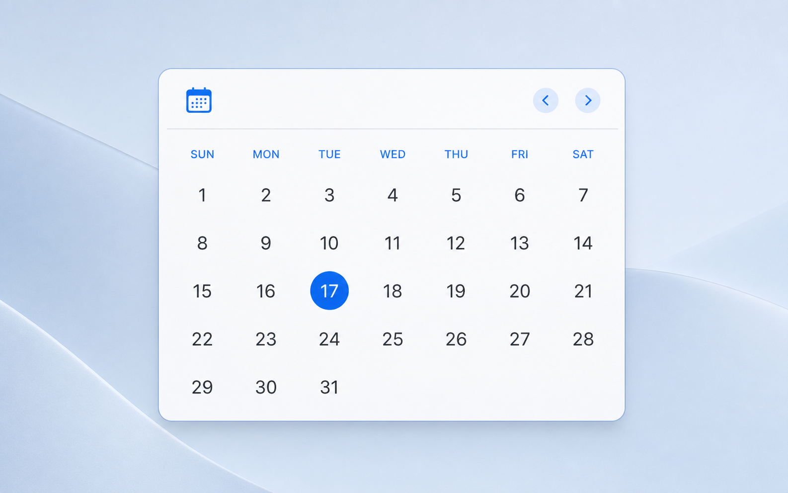

# Just Calendar Widget

[](https://github.com/maxxborer/just-calendar-widget/actions/workflows/ci.yml)
[](LICENSE)
[](https://github.com/maxxborer/just-calendar-widget/releases)

A focused macOS calendar companion with exactly three desktop widgets. Built with SwiftUI and WidgetKit — no accounts, calendar events, or third-party dependencies.

[Website](https://maxxborer.github.io/just-calendar-widget/) · [Download](https://github.com/maxxborer/just-calendar-widget/releases) · [Contributing](CONTRIBUTING.md) · [Security](SECURITY.md)

## What it is

Just Calendar Widget puts a clean, blue, macOS-style calendar on your desktop. It follows the system calendar, locale, first weekday, and time zone; the current day uses the system blue accent. No calendar events are read or stored.



| Widget | macOS size | Months |
| --- | --- | --- |
| Two Months | Medium (`2×1`) | Current and next |
| Four Months | Large (`2×2`) | Previous, current, and two next |
| Current Month | Large (`2×2`) | One large current month |

## Install

1. Download the `.dmg` from the [latest release](https://github.com/maxxborer/just-calendar-widget/releases).
2. Open the disk image and drag **Just Calendar Widget.app** onto **Applications**.
3. Eject the disk image. Do **not** run the app from the DMG.
4. Open **Just Calendar Widget** from Applications once.

The DMG contains the same bilingual installation guide. A file ending in `-adhoc.dmg` is a preview with an ad-hoc signature: it lets macOS register the bundled WidgetKit extension, but it has no Developer ID signature or Apple notarization.

### If macOS blocks the preview

After you try to open the app from Applications, choose **Apple menu → System Settings → Privacy & Security**, scroll to **Security**, and click **Open Anyway** for Just Calendar Widget. Confirm **Open** and authenticate if requested. This creates an exception only for this app; do not disable Gatekeeper globally or use Terminal bypass commands. Apple makes the button available for about one hour after the first launch attempt. Prefer a signed, notarized DMG when one is available.

## Use

Open the app once **from Applications**. If no widget is installed, it shows a three-step guide. Then Control-click the desktop, choose **Edit Widgets**, search for **Just Calendar Widget**, and pick one of the layouts above. WidgetKit registers a widget only after its containing app has been launched at least once after installation.

Use the blue chevrons in a widget to browse months. The selected period is shared by all copies of that widget type. Selecting a date opens the app and highlights that day.

## Updates and privacy

The app can check the repository's public GitHub Releases API for a newer version. It checks at most once every seven days, sends no account or calendar data, and only opens the release page after you choose **Open Release**. Disable automatic checks or run **Check Now** in **Just Calendar Widget → Settings**.

## Requirements and development

- macOS 14 or newer
- Xcode 16 or newer
- A development team with the `group.com.justcalendarwidget.shared` App Group enabled when signing a local build

Open [JustCalendarWidget.xcodeproj](JustCalendarWidget.xcodeproj) in Xcode, select your development team for both targets, then run the **JustCalendarWidget** scheme.

For a local unsigned verification build:

```sh
xcodebuild \
  -project JustCalendarWidget.xcodeproj \
  -scheme JustCalendarWidget \
  -derivedDataPath /tmp/just-calendar-widget-derived \
  CODE_SIGNING_ALLOWED=NO \
  test
```

## Releases

Every push or merged pull request to `main` or `master` is tested and automatically released as the next patch version. The workflow updates [Config/Version.xcconfig](Config/Version.xcconfig), commits the version, creates a tag, and publishes a GitHub Release with an installable DMG. If Apple Developer signing secrets are configured, the DMG is Developer ID signed and notarized; otherwise it is an ad-hoc-signed preview so the bundled WidgetKit extension can register.

```sh
# Start the next minor line: 0.1.0 → 0.2.0.
scripts/version.sh minor

# Start the next major line: 0.1.0 → 1.0.0.
scripts/version.sh major
```

The next push after either command produces the following patch release. See [the release guide](docs/releasing.md) for branch-protection requirements and Apple signing/notarization requirements for public production downloads.

## Website

The product website is a dependency-free static site in [`docs/`](docs). The GitHub Pages workflow publishes it at [maxxborer.github.io/just-calendar-widget](https://maxxborer.github.io/just-calendar-widget/) after GitHub Pages is enabled with **Settings → Pages → Source: GitHub Actions**.

After the first push, run **Bootstrap repository labels** once from the repository's **Actions** tab. It creates the labels used by issue forms and generated release notes.

## Community and support

Please read the [contribution guide](CONTRIBUTING.md), [Code of Conduct](.github/CODE_OF_CONDUCT.md), [support policy](SUPPORT.md), and [security policy](SECURITY.md) before opening an issue or pull request.

## License

This project is available under the [MIT License](LICENSE).
